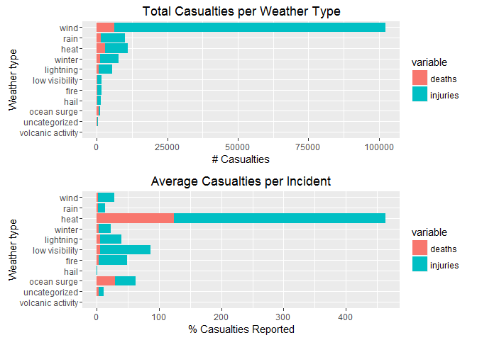
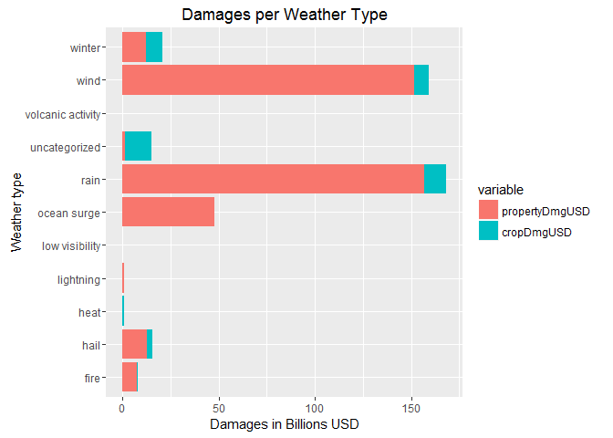

# Assessing Health and Economic Impact of Weather Events
Wolfgang Brandl  
20 Juni 2016  


## Synopsis of Study Results

This study U.S. National Oceanic and Atmospheric Administration's
(NOAA) storm database. This database tracks characteristics of major
storms and weather events in the United States, including when and
where they occur, as well as estimates of any fatalities, injuries,
and property damage.

Wind events, which include tornadoes and hurricanes, are by the far
the most harmful in aggregate, causing over 100,000 injuries and 90
deaths over the course of this study.  Though less frequent, severe
heat events have the highest incidence of deaths and injuries per
event.  This study finds that severe rain and wind events are by far
the most costly in terms of dollars spent to replace property and crop
damage.

## Questions this study considers

  1. Across the United States, which types of events (as indicated in the EVTYPE variable) are most harmful with respect to population health?
  1. Across the United States, which types of events have the greatest economic consequences?

## Notes about the environment used

```r
sessionInfo()
```

```
## R version 3.3.0 (2016-05-03)
## Platform: x86_64-w64-mingw32/x64 (64-bit)
## Running under: Windows 7 x64 (build 7601) Service Pack 1
## 
## locale:
## [1] LC_COLLATE=German_Austria.1252  LC_CTYPE=German_Austria.1252   
## [3] LC_MONETARY=German_Austria.1252 LC_NUMERIC=C                   
## [5] LC_TIME=German_Austria.1252    
## 
## attached base packages:
## [1] stats     graphics  grDevices utils     datasets  methods   base     
## 
## loaded via a namespace (and not attached):
##  [1] magrittr_1.5    formatR_1.4     tools_3.3.0     htmltools_0.3.5
##  [5] yaml_2.1.13     Rcpp_0.12.5     stringi_1.1.1   rmarkdown_0.9.6
##  [9] knitr_1.13      stringr_1.0.0   digest_0.6.9    evaluate_0.9
```

The full project may be found on Github at `https://github.com/gregoryg/05-reproducible-research-assignment-2`

## Data Processing
### Set libraries used in this analysis

```r
library(stringr)
library(lubridate)
library(sqldf)
library(ggplot2)
library(reshape2)
library(gridExtra)
```
## Set Work Area 

```r
wdroot <- file.path ("D:","Users","wbrandl","Coursera","ReproducableResearchCourseProject2")
setwd (wdroot)
if (!file.exists("data")){
  dir.create("data")
}
wd <- file.path ("D:","Users","wbrandl","Coursera","ReproducableResearchCourseProject2","data")
setwd (wd)
```

##Download and Loading and preprocessing the data
##### 1. Download data file
### Loading the data

```r
url <- "https://d396qusza40orc.cloudfront.net/repdata%2Fdata%2FStormData.csv.bz2"
zipfile <- "StormData.csv.bz2"
cleanfile <- "StormData.clean"

if (!file.exists(zipfile)) {
  download.file(url = url,destfile=zipfile, method="wininet", quiet = FALSE, mode = "wb",cacheOK = TRUE)
}

## For faster processing, check for R Data Set save file
## To force data cleaning, delete .RDS file before running/knitting/weaving
Loaded <- FALSE
if (!file.exists(cleanfile)) {
    d <- read.csv(file = bzfile(zipfile), strip.white = TRUE)
} else {
    d <- readRDS(cleanfile)
    Loaded <- TRUE
}
```


## Cleaning the data

Because we want to determine the most costly disasters, we have to
examine the the property damage (`PROPDMG`) and crop damage
(`CROPDMG`) values.  These are simple integers which must be
multiplied by an exponent given in another field (`PROPDMGEXP` and
`CROPDMGEXP` respectively.  Unfortunately, not all of the exponent
values are valid; many appear to be rounding or entry errors from
older entry systems.

For the purposes of this study, we accept only the following values
for exponent:
  * H hundred (x100)
  * K thousand (x1,000)
  * M million (x1,000,000)
  * B billion (x1,000,000,000)


```r
if(!Loaded) {
    calcUSD <- function(dmg, dmgexp) dmg * switch(toupper(dmgexp), H=100, K=1000, M=1000000, B=1000000000, 1)

    d$pdmgUSD <- mapply(calcUSD, d$PROPDMG, d$PROPDMGEXP)
    d$cdmgUSD <- mapply(calcUSD, d$CROPDMG, d$CROPDMGEXP)
}
```

To assist in date analysis, we will convert dates to POSIXct format


```r
if(!Loaded)
    d$BEGIN_UTC <- mdy(str_extract(d$BGN_DATE, "[^ ]+"))
```

The manual entry nature of the data causes huge difficulties in
categorizing the weather events.  For example, you will find high wind
events entered in completely arbitrary ways, mixing terminology,
abbreviations, upper and lower case etc. (`thunderstorm`, `gusty
thunderstorm wind`, `gusty wind/rain`, `marine tstm wind`).  We are
going to attempt to categorize the most impactful events by looking
for common words and abbreviations in a relative handful of weather
categories.


```r
if (!Loaded) {
    generateEvent <- function(evt) {
        evt <- tolower(evt)
        ifelse(grepl("lightning", evt), "lightning",
               ifelse(grepl("hail", evt), "hail",
                      ifelse(grepl("rain|flood|wet|fld", evt), "rain",
                             ifelse(grepl("snow|winter|wintry|blizzard|sleet|cold|ice|freeze|avalanche|icy", evt), "winter",
                                    ifelse(grepl("thunder|tstm|tornado|wind|hurricane|funnel|tropical +storm", evt), "wind",
                                           ifelse(grepl("fire", evt), "fire",
                                                  ifelse(grepl("fog|visibility|dark|dust", evt), "low visibility",
                                                         ifelse(grepl("surf|surge|tide|tsunami|current", evt), "ocean surge",
                                                                ifelse(grepl("heat|high +temp|record +temp|warm|dry", evt), "heat",
                                                                       ifelse(grepl("volcan", evt), "volcanic activity",
                                                                              "uncategorized"
                                                                              ))))))))))
    }
    d$weatherCategory <- mapply(generateEvent, d$EVTYPE)
}
```


For purposes of this study, USA is defined as the 50 states in the
continental US, plus District of Columbia, Hawaii and
Alaska. territories, protectorates, and military regions are excluded


```r
if (!Loaded)
    d$isUSA <- mapply( function(st) st %in% state.abb, d$STATE )
```

In the interest of performance, we will save the data frame as an R
data set (`.RDS` file).  After reading, immediately subset the data to
only those records originating in the US.


```r
if (!Loaded) {
    saveRDS(d, file=cleanfile)
    d <- readRDS(cleanfile)
    Loaded <- TRUE
}
## subset to only USA data
d <- d[d$isUSA == TRUE,]
```

## Results
### Question 1: Across the United States, which types of events (as indicated in the EVTYPE variable) are most harmful with respect to population health?

Refer to the result of the query below, which groups US mortalities and injuries by weather category.


```r
harm <- sqldf("select sum(FATALITIES) as deaths, sum(INJURIES) as injuries, weatherCategory,count(*) as sumrecs from d group by weatherCategory ")

harm$weatherCategory <- factor(harm$weatherCategory, levels=harm[order(harm$injuries), "weatherCategory"])

## ggplot loves long form, which means a type of normalization using melt()
hdat <- melt(harm, id.vars=c("weatherCategory", "sumrecs"), measure.vars=c("deaths", "injuries"))
hdat <- sqldf("select *,(value/sumrecs)*100 as pctPerEvent from hdat")
plot1 <- ggplot(hdat, aes(x=weatherCategory, y=value, fill=variable)) + geom_bar(stat="identity") + coord_flip() + ggtitle("Total Casualties per Weather Type") + xlab("Weather type") + ylab("# Casualties")
plot2 <- ggplot(hdat, aes(x=weatherCategory, y=pctPerEvent, fill=variable)) + geom_bar(stat="identity") + coord_flip() + ggtitle("Average Casualties per Incident") + xlab("Weather type") + ylab("% Casualties Reported")
grid.arrange(plot1, plot2)
```

<!-- -->

Wind events -- including tornadoes and hurricanes -- have the highest
impact on health in terms of absolute numbers reported.  Heat events
-- including fires and heat waves -- show the highest percentage of
casualties per event.

### Question 2: Across the United States, which types of events have the greatest economic consequences?


```r
crop <- sqldf("select sum(pdmgUSD) as propertyDmgUSD, sum(cdmgUSD) as cropDmgUSD, count(*) as sumrecs, weatherCategory from d group by weatherCategory")
crop <- sqldf("select *, propertyDmgUSD + cropDmgUSD as totalCost from crop")
## create long form on crop vs property damage columns
cdat <- melt(crop, id.vars=c("weatherCategory", "sumrecs", "totalCost"), measure.vars=c("propertyDmgUSD", "cropDmgUSD"))
cdat <- sqldf("select *, (value/sumrecs) as costPerEvent from cdat")
plot3 <- ggplot(cdat, aes(x=weatherCategory, y=value/1000000000, fill=variable)) + geom_bar(stat="identity") + coord_flip() + ggtitle("Damages per Weather Type") + xlab("Weather type") + ylab("Damages in Billions USD")
grid.arrange(plot3)
```

<!-- -->

Rain and wind events are the most costly weather types, both in terms
of property and damage to crops.  There is a very significant crop
damage cost in the "uncategorized" weather events.  This bears
examination, and possibly some re-evaluation of the categorization
used in this study.  

## Appendix
### Utility functions
Some functions not used in the published analysis that may be useful


```r
## timeconv() is used to take inconsistent times and convert them to a standard format
## times will either be 24-hour HHMM ("1330") or 12-hour strings with AM/PM ("01:30:00 PM")
## functions returns format of 24-hour HH:MM:SS ("13:30:00")
timeconv <- function(x) {
    if (nchar(x) == 4) {
        paste(substr(x,1,2), substr(x,3,4), "00", sep=":")
    } else {
        timeadd <- 1
        if (substr(x,nchar(x)-1,nchar(x)) == "PM") timeadd <- 12
        paste0(
            formatC(as.integer(substr(x,1,2)) + timeadd, width=2, format="d", flag="0"),
            substr(x,3,nchar(x)-3))
    }
}
```
